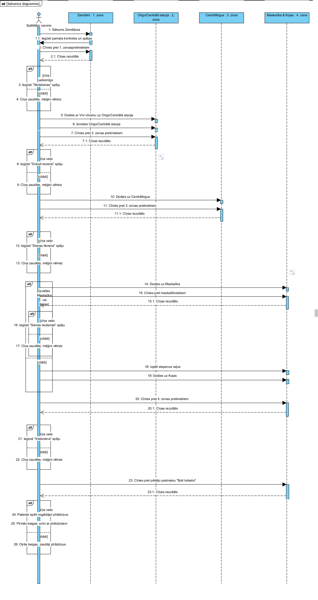

# Autori
Edgars Reichmanis-Norbuts, Rihards Raginskis-Repše, Bruno Kančs

# Idejas apraksts
	Origo, Maskačka, Centrāltirgus, Kojas  visām šīm vietām ir viena kopīga īpašība – pamatīgs pigoru apjoms un bagātīga kultūra, un šī kultūra ir neskarta zelta bedre, kas diemžēl nav pietiekami parādīta mūsdienu kultūrā piemēram filmās, seriālos, grāmatās un jā arī videospēlēs. Nu tad mums kopīgi radās doma – Kāpēc neapvienot šos Rīgas kultūras stūrakmeņus vienā programmēšanas projektā un šajā gadījumā videospēlē?
	Un mēs izvēlējāmies to darīt, bet videospēle ir varen plašs virsraksts kurā var iekļaut neskaitāmus dažādus žanrus un veidus sākot ar 2D vienkāršotēm uz fizikas likumiem bāzētām spēlēm kā “Pong” vai “Tetris” un beidzot ar plašām 3D pasaulēm pildītām pat vis sīkākajām detaļām piemēram “Red Dead Redemption 2” vai “Grand Theft Auto 6”, tomēr mēs izvēlējāmies mēģināt izveidot ko kautkur pa vidu starp šiem ekstrēmiem, žanrs ko mēs izvēlējāmies pazīstams ar nosaukumu “Metroidvania” kas ir kā apvienojums starp “Metroid” un “Castlevania” videospēļu frančīzēm, citas iedvesmas iekļauj “Ori and the will of the wisps” un “Guacamelle”, tātad žānrs ir izvēlēts, bet tas vēl nav viss.
	Izvēlējāmies Metroidvania žanru, jo tas ir salīdzinoši vienkāršs stils ko attēlot ņemot vērā to ka tas ir 2d telpā, kas samazina darba apjomu, un jo šāda tipa spēles parasti ir īsākas, kas samazina apjomu vēl nedaudz. Šāda tipa spēles parasti ir sadalītas dažādās “zonās”, kas atšķirās šķēršļu un pretinieku veidos un izskatos, mūsu spēlē izvēlētās zonas ir “Zemitāni”, “Origo/Centrālā stacija”, “Centrāltirgus”, “Maskačka”, “Ķīpsala/Kojas” kā redzams visas zonas ir kāda bēdīgi slavena vai vinkārši mums bieži apmeklēta vieta Rīgā, kas ļoti atbilst mūsu spēles mērķim. 
	Zemitāni, tiek plānoti kā šī sākuma zona, jeb tā saucamais pamācības līmenis, te spēlētājs tiks iepazīstināts ar kontrolēm, un iespējām un robežām, kā arī iegūs sākuma prasmes cīnoties ar pirmajiem pretiniekiem – “Gopņikiem” un “Gopņikiem ar pudelēm”, kā arī ar pirmo Bosa cīņu pret “Krievu” pēc kuras tiks iegūts pirmais īpašais spēks, kas ir “sprintiņš”. Zemitāni būs arī sākuma punkts spēles stāstam, un ceļs lai nonāktu nākamajā zonā būs “Vivi” vilciens.
	Izkāpjot no vilciena nonāksim “Origo” kur saražģītības līmenis būs nedaudz augstāks, un parādīsies arī citi pretinieki – “Bomzis” un “Policija” un šīs zonas boss būs “Tuneļa muzikants”, šīs zonas īpašais spēks ko spēlētājs iegūs būs dubultlēciens, pēc kura iegūšanas varam nonākt nākamajā zonā – “Centrāltirgū”
	Centrāltirgū kā jau parasti parādīsies jauni pretinieki – “Tirgus tantiņas” un “Kaijas” un arī jauna bosa cīņa – “Tirgus Spekulants” pēc kuras iegūsiet iespēju skriet pa sienām. Šeit arī būs vienīgā vieta spēlē, kur spēles taka sadalīsies divās daļās, izvēloties 7. Tramvaja brauciena virzienu starp “Maskačku” un “Ķīpsalu”, kas nozīmē, ka ir iespēja doties pa taisno uz spēles beigām, vai neduadz garāko ceļu caur Maskačku ar iespēju iegūt slepenas spēles beigas.
	Ja izvēlies nonākt Maskačkā, jauni pretinieki nebūs, bet būs jauna bosa cīņa pret “Maskačkas narkomānu” pēc kuras var iegūt iespēju lauzt sienas, un iespēja iegūt kautko, kas palīdz nonākt pie slepenajām beigām.
	Pēc tam var nonākt pēdējajā zonā Ķīpsalā, kur parādās pēdējie jaunie pretinieki “Celtnieki” un “Indieši”, kā arī divas bosa cīņas “Biļešu kontrole”, kas ir neobligāta cīņa, kas dod trīskāršo lēcienu, un “Bolt Indietis”, kas ir pēdējais Boss tipa pretinieks spēlē, pēc kura, nonāksi pie kādas no 3 beigām.
	Spēles stāsts ir diezgan vienkāršs: Tavam čomam paliek 18 un kojās notiek svinēšana, tu esi zemitānos pie omītes, kura tev iedod pīrādziņus ciema kukulim, bet tā kā pīrādziņi smaržo varen gardi, tu esi mērķis visiem kuri tos no tevis vēlas nozagt, spēles mērķis ir nonākt pie čoma ar neskartiem pīrādziņiem, un iespējams ar vēl ko no maskačkas.
	Darbs tiks sadalīts 3 daļās, Spēles loģika un mugurkauls Riharda vadībā, Pretinieki Bruno vadībā, un Māksla manā Edgara vadībā.

# Lietotāji
Projekts ir tēmēts mūsdienu jaunatnei, tas ir mūsu vienaudžiem, cilvēkiem, kuri ir ieinteresēti "metroidvania" videospēles žanrā, kā arī interesentiem par Latvijas kultūru un sabiedrisko dzīvi.

# Tehneloģijas
Projekts tiks veidots spēles dzinējā "Godot", izmantojot tā iebūveto valodu GD script, vajadzības gadījumā var izmantot citas valodas, kas ir piemērots šāda tipa/žanra spēlēm, atvieglojot gan veidotāju (mūsu), gan lietotāju pieredzi.

# Piegādes formāts
Šis projekts tiks ievietots videospēļu piegādes platformā "Steam" ar mērķi piegādāt to pēc iespējas plašākai auditorijai. Pēc nepieciešamības tiks izsniegti tās saucamās "atslēgas", lai piekļūtu projektam. Programmu ir paredzēts pasniegt kā lietotni, tā nebūs saderīga ar mobīlajiem lietotājiem.

# Darba Plāns
| Datums | Edgars - Darba apraksts | Rihards - Darba apraksts | Bruno - Darba apraksts |
| ----------- | ----------- | ----------- | ----------- | 
| 10.02.2026 | Izveidot zemitānu 1. daudzdzīvokļu māju, un pagalmu | Nostiprināt spēles sākuma iestatījumus, izvērtējot kādas problēmas var vēlāk parādīities tās veidošanā. | Izveidot pirmajam pretinieku tipam hitbox un roaming | 
| 17.02.2026 | Pilnveidot fonu, pievienot miglas efektu, izveidot UI | Salabot nevēlāmās animācijas un problēmas ar tēla kustību. | Apraksts |
| 24.02.2026 | Izveidot zemitānus līdz stacijai | Izveidot galvenajam varonim dažādas papildus kustības, kā piemēram, (dash, wall jumo, utt.) | Apraksts |
| 03.03.2026 | Pilnveidot zemitānus izveidot animācijas | Izveidot līdzkustīgus, ieskaujošus fonus. | Apraksts |
| 10.03.2026 | izveidot animācijas zemitānu pretiniekiem kā arī spēlētājam un UI elementiem | Uzlabot animācijas, tēla reaģētspēju uz nospiestiem taustiņiem u.c., lai pēc iespējas vairāk uzlabotu spēlēšanas sajūtu.| Apraksts |
| 17.03.2026 | izveidot Origo līmeņa uzmetumu un pretiniekus | Ieviest dažādas iespējas spēlētājam mijiedarboties ar apkārtējo vidi un priekšmetiem. | Apraksts |
| 24.03.2026 | pilnveidot origo līmeni un pretinieku animācijas | Izveidot dažādus priekšmetus, kuri pilda konkrētu funkcija, kad ar tiem mijiedarbojas. | Apraksts |
| 31.03.2026 | izveidot centrāltirgus līmeni un pretiniekus | Izveidot spēlētāja somu(inventory), kurā iespējams ievietot mantas. | Apraksts |
| 07.04.2026 | pilnveidot centrāltirgu un pretinieku animācijas | Izstrādāt dažādas mantas ar atribūtiem, kuras ir iespējams spēlētājam pielietot. | Apraksts |
| 14.04.2026 | izveidot pazemes zonu | Izveidot sistēmu, kas nodrošina progresa, mantu saglabāšanu pēc spēles izslēgšanas uz spēlētāja datora lokāli. | Apraksts |
| 21.04.2026 | izveidot veikala UI, animācijas un spēlētāja animācijas jauniem atribūtiem | Spēlē ievietot izveidoto mūziku un skaņas efektus. | Apraksts |
| 28.04.2026 | izveidot ēnas, ūdeni un citus shaders kā arī statisko objektu animācijas | Iekārtot spēlē vietas no kurām iespējams nokļūt uz citām zonām. | Apraksts |
| 05.05.2026 | testēt esošo projektu un mainīt kā arī uzlabot mākslas stilu kur nepieciešams| Veikt spēles testēšanu un atrisināt atrastās problēmas. | Apraksts |

# Sagaidāmais rezultāts
Visas sienas, līdz circle K ir cietas un strādājošas(izņemot logs), kāpņu telpā platformas strādā kā vienvirziena platformas, ir strādājoša konsole un inventāra saraksts, ir strādājošas dzīvības un  valūtas sistēma, kameras kustība tuvplānā 1. ēkā. gopņiks seko spēlētājam tuvumā un atgriežas mājās ja gribās.

# UML Sekvences Diagramma - karte, pārvietošanās

